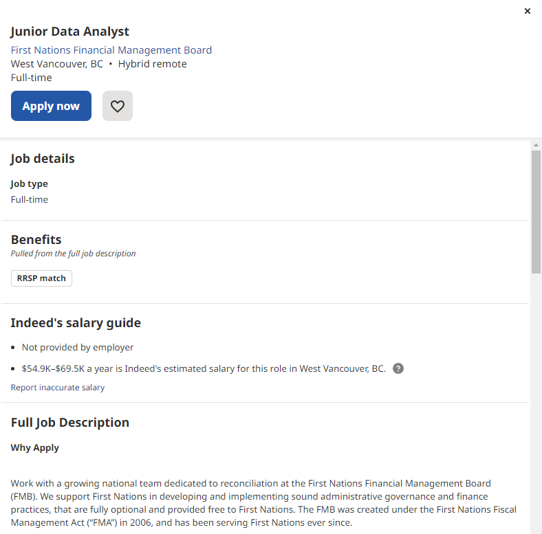

# Job Board Project
In this project, I have some figures from Indeed. If this were a portfolio piece, maybe I would say that I created a mock-up of the site using HTML, CSS, and Javascript.

Here is a sample image of the site: 



The main part of this project (although it isn't relevant according to the description above) is SQL. Here is a sample SQL query that could be used to generate the jobs displayed in the above image. 

```sql
SELECT 
  *
FROM
  jobs
WHERE
  description LIKE '%data%' OR description LIKE '%science%'
```
